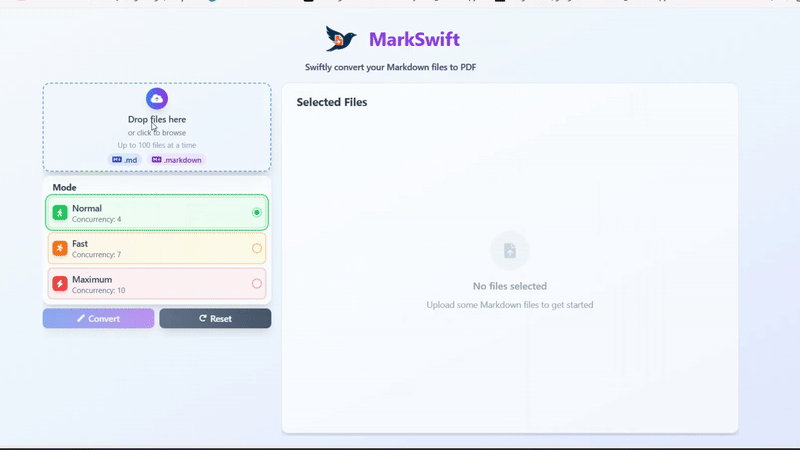

# MarkSwift

<div align="center">
  
  <p><em>Swiftly convert your Markdown files to PDF</em></p>
  
  <!-- Demo GIF -->
  
  
  <p><strong>See MarkSwift in action!</strong> Upload multiple Markdown files and convert them to PDF with real-time progress tracking.</p>
</div>

## Summary

MarkSwift is a web application that allows users to upload multiple Markdown files (.md, .markdown) and convert them into PDF documents. It provides real-time progress updates via WebSockets and offers different concurrency modes for conversion. Processed files can be downloaded as individual PDFs or as a single ZIP archive if multiple files were converted.

## Features

*   **Beautiful PDF Output:** Generates professionally formatted, clean PDFs with proper typography, styling, and layout preservation from your Markdown content.
*   **Batch Conversion:** Upload and convert multiple Markdown files simultaneously.
*   **Web Interface:** User-friendly interface for uploading files and selecting conversion mode.
*   **Real-time Progress:** Track the conversion status of your files in real-time using WebSockets.
*   **Concurrency Modes:**
    *   **Normal:** Balances speed and resource usage (default: 4 concurrent processes).
    *   **Fast:** Prioritizes quicker processing (default: 7 concurrent processes).
    *   **Max:** Utilizes maximum configured concurrent processes for the fastest possible conversion (default: 10 concurrent processes).
*   **Download Options:**
    *   Download a single PDF if only one file is successfully converted.
    *   Download a ZIP archive containing all successfully converted PDFs for batch uploads.
*   **Session Management:** Each conversion batch is handled in an isolated session with unique identifiers.
*   **Automatic Cleanup:** Temporary files (uploads, generated PDFs, ZIPs) are automatically cleaned up after download or a timeout period.
*   **File Validation:** Accepts only Markdown files (`.md`, `.markdown`) and has a file size limit (10MB per file).
*   **Secure by Design:** Uses `crypto` for secure session ID generation and `multer` for robust file upload handling.
*   **Modern Frontend:** Styled with Tailwind CSS.

## Functionality Overview

1.  **Upload:** The user selects one or more Markdown files through the web interface and chooses a conversion mode.
2.  **Session Initiation:** The server receives the files, generates a unique session ID, and immediately responds to the client.
3.  **WebSocket Connection:** The client-side JavaScript uses this session ID to establish a WebSocket connection with the server.
4.  **Conversion Process:**
    *   The server uses the `MarkdownToPDFConverter` (leveraging Puppeteer for accurate rendering) to convert each Markdown file to PDF.
    *   The number of concurrent conversions is determined by the selected mode.
5.  **Progress Updates:** The server sends progress updates (e.g., "Preparing files...", "Converting file X of Y...", "Zipping files...") to the client over the WebSocket connection.
6.  **Completion & Download:**
    *   Once all files are processed, the server sends a 'complete' message with a download link.
    *   If one PDF was generated, a direct link to the PDF is provided.
    *   If multiple PDFs were generated, they are zipped, and a link to the ZIP file is provided.
7.  **Cleanup:** After the user downloads the file(s), or after a certain period of inactivity, the server automatically deletes the temporary files associated with that session.

## Setup and Running the Project

### Prerequisites

*   Node.js (v16.x or later recommended)
*   npm (comes with Node.js)

### Installation & Setup

1.  **Clone the repository (if applicable):**
    ```bash
    git clone https://github.com/Rkcr7/MarkSwift
    cd MarkSwift
    ```

2.  **Install dependencies:**
    ```bash
    npm install
    ```
    This will install all necessary packages listed in `package.json`, including Express, Puppeteer, Tailwind CSS, etc.

3.  **Build Tailwind CSS:**
    MarkSwift uses Tailwind CSS. The CSS needs to be built from `public/css/input.css` to `public/css/tailwind.css`.
    *   For a one-time build:
        ```bash
        npm run build:css
        ```
    *   The `start` and `dev` scripts automatically handle CSS building.

### Running the Application

*   **Development Mode:**
    This mode uses `nodemon` to automatically restart the server on file changes and `concurrently` to watch for CSS changes and rebuild Tailwind CSS.
    ```bash
    npm run dev
    ```

*   **Production Mode:**
    This mode first builds the CSS and then starts the server.
    ```bash
    npm run start
    ```

After starting the server, the application will typically be accessible at:
`http://localhost:3000` (or the port specified by `process.env.PORT`).

## Project Structure

```
.
├── public/                     # Client-side static assets
│   ├── css/
│   │   ├── custom.css          # Custom user styles
│   │   ├── input.css           # Tailwind CSS input
│   │   └── tailwind.css        # Generated Tailwind CSS
│   ├── images/
│   │   ├── favicon.ico         # Website favicon
│   │   ├── logo.png            # MarkSwift logo
│   │   └── MarkSwift.gif       # Demo showcase GIF
│   ├── js/
│   │   └── main.js             # Client-side JavaScript for UI and WebSocket
│   └── index.html              # Main HTML page
├── server/                     # Backend server logic
│   ├── converted-pdfs/         # Temporary storage for generated PDFs (session-based)
│   ├── uploads/                # Temporary storage for uploaded Markdown files (session-based)
│   ├── zips/                   # Temporary storage for generated ZIP archives (session-based)
│   ├── converter.js            # Core Markdown to PDF conversion logic (uses Puppeteer)
│   └── server.js               # Express server setup, API routes, WebSocket handling
├── .gitignore
├── package.json
├── package-lock.json
├── tailwind.config.js          # Tailwind CSS configuration
└── README.md                   # This file
```

## API Endpoints

*   `POST /api/convert`:
    *   Handles multipart/form-data file uploads (field name: `markdownFiles`).
    *   Accepts `mode` in the form body (`normal`, `fast`, `max`).
    *   Returns a JSON response with `sessionId`.
*   `GET /api/download/pdf/:sessionId/:filename`:
    *   Downloads a single converted PDF file.
*   `GET /api/download/zip/:sessionId/:filename`:
    *   Downloads a ZIP archive of multiple converted PDF files.
*   **WebSocket Endpoint:** `ws://localhost:PORT/?sessionId=<sessionId>`
    *   Used for real-time progress updates from server to client.

## Configuration

MarkSwift uses a `config.json` file to manage important settings. This file is automatically created with default values when the server starts if it doesn't exist.

### Configuration File (`config.json`)

The configuration file contains the following settings:

```json
{
    "appName": "MarkSwift",
    "port": 3000,
    "fileUploadLimits": {
        "maxFileSizeMB": 10,
        "maxFilesPerBatch": 100
    },
    "concurrencyModes": {
        "normal": 4,
        "fast": 7,
        "max": 10
    },
    "cleanupSettings": {
        "periodicScanIntervalMinutes": 30,
        "orphanedSessionAgeHours": 3
    },
    "logging": {
        "level": "info"
    }
}
```

### Configuration Options

**File Upload Limits:**
*   `maxFileSizeMB`: Maximum file size per uploaded file (default: 10MB)
*   `maxFilesPerBatch`: Maximum number of files per upload batch (default: 100)

**Concurrency Modes:**
*   `normal`: Balanced processing (default: 4 concurrent files)
*   `fast`: Faster processing (default: 7 concurrent files)
*   `max`: Maximum speed processing (default: 10 concurrent files)

**Cleanup Settings:**
*   `periodicScanIntervalMinutes`: How often to scan for orphaned session files (default: 30 minutes)
*   `orphanedSessionAgeHours`: Age threshold for cleaning up orphaned session files (default: 3 hours)

**Other Settings:**
*   `port`: Server port (default: 3000, can be overridden by `PORT` environment variable)
*   `appName`: Application name used in branding
*   `logging.level`: Logging level for future logging enhancements

### File Cleanup Strategy

MarkSwift implements a multi-layered cleanup strategy to prevent server storage issues:

1. **Immediate Cleanup:**
   - Upload files are deleted immediately after processing
   - Individual PDF files are deleted after being zipped (for multi-file conversions)

2. **Download Cleanup:**
   - Remaining files are cleaned up 5 seconds after successful download

3. **Periodic Cleanup:**
   - Every 30 minutes (configurable), the server scans for orphaned session files
   - Files older than 3 hours (configurable) are automatically deleted
   - Runs on server startup and then at regular intervals

## Dependencies

Key dependencies include:
*   **Express.js:** Web framework
*   **Puppeteer:** Headless Chrome for PDF conversion
*   **Multer:** File upload handling
*   **Archiver:** ZIP file creation
*   **ws:** WebSocket server implementation
*   **fs-extra:** File system operations
*   **Tailwind CSS:** CSS framework
*   **Marked:** Markdown parsing
*   **DOMPurify & JSDOM:** HTML sanitization and manipulation

For a full list of dependencies, see `package.json`.

## Development

### Scripts

*   `npm run start` - Build CSS and start the production server
*   `npm run dev` - Start development mode with auto-restart and CSS watching
*   `npm run build:css` - Build Tailwind CSS once

### Troubleshooting

*   If you encounter issues with Puppeteer installation, try running `npm install puppeteer --force`
*   On Windows, ensure you have the necessary build tools installed for native dependencies
*   If the application fails to start, check that port 3000 is available or set the `PORT` environment variable

## License

This project is licensed under the MIT License.
