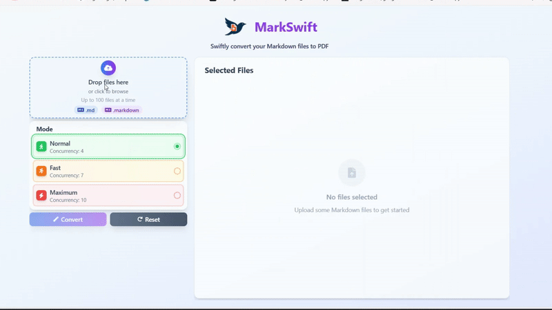

# MarkSwift

<div align="center">
  
  <p><em>Swiftly convert your Markdown files to PDF</em></p>

  <p>
    <a href="https://markswift.ritikcr7.rest"></a>
  </p>

  <h3><a href="https://markswift.ritikcr7.rest">Try it live at markswift.ritikcr7.rest</a></h3>
  <p><em>No sign up, no upload limits per account, and files are removed from the server after download.</em></p>

  <p>
    
    
    
  </p>

  
  <!-- Demo GIF for Batch Upload -->
  
  <p><strong>See MarkSwift's batch conversion in action!</strong></p>
  
  <!-- Live Editor Demo GIF -->
  
  <p><strong>Explore the powerful Live Editor!</strong></p>
</div>

## Summary

MarkSwift is a versatile web application designed for seamless Markdown to PDF conversion. It offers two primary modes of operation:
1.  **Batch File Conversion:** Upload multiple Markdown files (`.md`, `.markdown`) for efficient conversion into PDF documents, complete with real-time progress updates.
2.  **Live Markdown Editor:** An integrated, feature-rich editor allowing you to write, preview, and convert Markdown to PDF, all within a single interface.

MarkSwift focuses on producing professionally formatted PDFs, providing a user-friendly experience, and ensuring robust backend processing.

## Key Features

### 🌟 Live Markdown Editor
A powerful new way to work with your Markdown documents directly in MarkSwift:
*   **Interactive Editing:** A dedicated "Live Editor" tab provides a sophisticated environment for creating and modifying Markdown content.
*   **Real-time Split Preview:** Instantly see your Markdown rendered as HTML in a side-by-side view, updating dynamically as you type.
*   **Direct PDF Conversion:** Convert the content from the live editor to a high-quality PDF with a single click.
*   **Synchronized Scrolling:** Optionally sync the scroll position between the Markdown editor (CodeMirror) and the HTML preview pane for a seamless writing and review experience.
*   **Content Persistence:** Your editor content is automatically saved to your browser's local storage, allowing you to resume your work later.
*   **Editor Themes:** Customize your CodeMirror editing environment by choosing from multiple themes (Neat Light, Dracula Dark, Material Light), with your preference also saved locally.

### 🎨 Enhanced Code Block Styling
MarkSwift now renders your code blocks beautifully and consistently:
*   **Syntax Highlighting:** Code blocks in your Markdown are syntax-highlighted using `highlight.js`.
*   **PaperColor Light Theme:** Utilizes the "PaperColor Light" theme for clear, readable, and aesthetically pleasing code presentation in both the live preview and the final PDF output.
*   **Consistent Look & Feel:** Enjoy a uniform and professional appearance for your code snippets across the application.
    *Example of how a code block might appear (styling applied in-app):*
    ```javascript
    // example.js
    function greet(name) {
      console.log(`Hello, ${name}!`);
    }
    greet('MarkSwift User');
    ```

### (Batch Conversion)
*   **Efficient Batch Processing:** Upload and convert multiple Markdown files simultaneously.
*   **Web Interface:** User-friendly drag-and-drop or file selection interface.
*   **Real-time Progress & Queue Management:**
    *   Track the conversion status of your files in real-time using WebSockets.
    *   Accurate queue position updates and estimated wait time display.
*   **Concurrency Modes:**
    *   **Normal:** Balances speed and resource usage.
    *   **Fast:** Prioritizes quicker processing.
    *   **Max:** Utilizes maximum configured concurrent processes for the fastest possible conversion.
*   **Download Options:**
    *   Download a single PDF if only one file is successfully converted.
    *   Download a ZIP archive containing all successfully converted PDFs for batch uploads.

### ⚙️ General & Backend Features
*   **Beautiful PDF Output:** Generates professionally formatted, clean PDFs with proper typography and layout preservation.
*   **Session Management:** Each conversion batch/editor session is handled with unique identifiers.
*   **Automatic Cleanup:** Temporary files are automatically cleaned up after download or a configurable timeout.
*   **File Validation:** Accepts only Markdown files and has file size limits.
*   **Secure by Design:** Uses `crypto` for secure session ID generation and `multer` for robust file upload handling.
*   **Modern Frontend:** Styled with Tailwind CSS, featuring a responsive and intuitive UI.
*   **Modular Codebase:** Refactored backend and frontend for improved maintainability and scalability.

## Functionality Overview

1.  **Batch File Conversion Flow:**
    *   **Upload:** User selects Markdown files and a conversion mode.
    *   **Session & WebSocket:** Server initiates a session, client connects via WebSocket.
    *   **Conversion:** Server converts files using Puppeteer, respecting concurrency mode.
    *   **Progress:** Real-time updates sent to the client.
    *   **Download:** Link provided for single PDF or ZIP archive.

2.  **Live Editor Flow:**
    *   **Navigate:** User selects the "Live Editor" tab.
    *   **Edit & Preview:** User types/pastes Markdown; HTML preview updates in real-time. Editor content, theme, and sync scroll preferences are saved locally.
    *   **Convert (Optional):** User clicks the "PDF" button.
    *   **Progress & Download:** Server processes the editor's content, sends progress via WebSockets, and provides a download link for the generated PDF.

3.  **Cleanup:** Server automatically deletes temporary files post-download or after inactivity.

## Setup and Running the Project

### Prerequisites

*   Node.js (v16.x or later recommended)
*   npm (comes with Node.js)

### Installation & Setup

1.  **Clone the repository (if applicable):**
    ```bash
    git clone https://github.com/Rkcr7/MarkSwift 
    cd MarkSwift
    ```

2.  **Install dependencies:**
    ```bash
    npm install
    ```

3.  **Build Tailwind CSS:**
    *   For a one-time build: `npm run build:css`
    *   (Note: `start` and `dev` scripts automatically handle CSS building.)

### Running the Application

*   **Development Mode (recommended for local development):**
    Uses `nodemon` for server auto-restart and `concurrently` for CSS watching.
    ```bash
    npm run dev
    ```

*   **Production Mode:**
    Builds CSS then starts the server.
    ```bash
    npm run start
    ```

Access the application at: `http://localhost:3000` (or `process.env.PORT`).

## Project Structure

```
.
├── public/                     # Client-side static assets
│   ├── css/
│   │   ├── custom.css
│   │   ├── input.css           # Tailwind CSS input
│   │   ├── papercolor-light.min.css # Highlight.js theme
│   │   └── tailwind.css        # Generated Tailwind CSS
│   ├── images/                 # Logos, favicons, demo GIFs
│   ├── js/
│   │   ├── main.js             # Main frontend entry point
│   │   └── modules/            # Frontend JavaScript modules (fileUploadUI, liveEditor, etc.)
│   └── index.html              # Main HTML page
├── server/                     # Backend server logic
│   ├── assets/                 # Server-side assets (e.g., highlight.js CSS for PDF)
│   │   └── papercolor-light.min.css
│   ├── controllers/            # Request handlers (uploadController, editorController)
│   ├── routes/                 # API route definitions
│   ├── services/               # Business logic (conversionService, cleanupService)
│   ├── websocket/              # WebSocket handling logic
│   ├── converted-pdfs/, uploads/, zips/ # Temporary storage
│   ├── converter.js            # Core Markdown to PDF conversion (Puppeteer, highlight.js)
│   └── server.js               # Express server setup
├── .gitignore
├── config.json                 # Application configuration
├── Dockerfile
├── MAINTENANCE.md
├── package.json
├── tailwind.config.js
└── README.md                   # This file
```
*(Other deployment guides like `DEPLOYMENT_DO.md`, `DEPLOYMENT_GCP.md` and `scripts/` also exist.)*

## API Endpoints

*   `POST /api/convert`: Handles batch Markdown file uploads.
    *   Accepts `markdownFiles` (multipart/form-data) and `mode`.
    *   Returns `{ sessionId }`.
*   `POST /api/editor/convert-pdf`: Converts Markdown text from the Live Editor.
    *   Accepts JSON payload: `{ markdownText: "..." }`.
    *   Returns `{ sessionId, jobId }`.
*   `GET /api/download/pdf/:sessionId/:filename`: Downloads a single PDF.
*   `GET /api/download/zip/:sessionId/:filename`: Downloads a ZIP archive.
*   **WebSocket:** `ws://localhost:PORT/?sessionId=<sessionId>` for real-time progress.

## Configuration

MarkSwift uses a `config.json` file (auto-generated with defaults if not present). Key settings include file limits, concurrency, cleanup intervals, and queue parameters. *(Refer to the `config.json` section in the previous README version or the file itself for full details, as it's extensive).*

## Deployment

MarkSwift is Docker-ready. See:
*   **[DigitalOcean Droplet Deployment Guide](./DEPLOYMENT_DO.md)**
*   **[Google Cloud Platform Deployment Guide](./DEPLOYMENT_GCP.md)**
*   **[Maintenance Guide](./MAINTENANCE.md)**

## Development

### Scripts
*   `npm run start`: Production server.
*   `npm run dev`: Development server with auto-reloads.
*   `npm run build:css`: One-time CSS build.

### Puppeteer Configuration
Puppeteer's Chrome/Chromium path is handled automatically for production (Docker) and local development environments. See the "Puppeteer Configuration for Different Environments" section in the previous README version for details if needed.

## License

This project is licensed under the MIT License.
